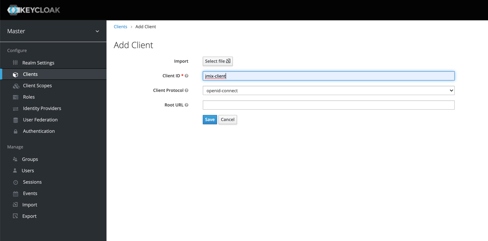
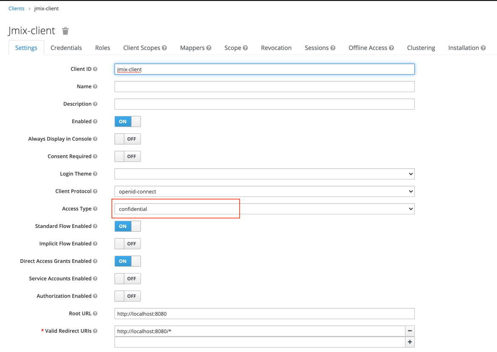
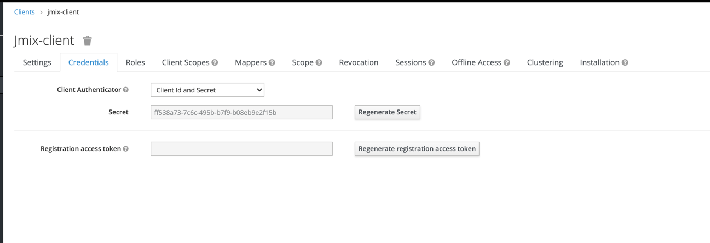
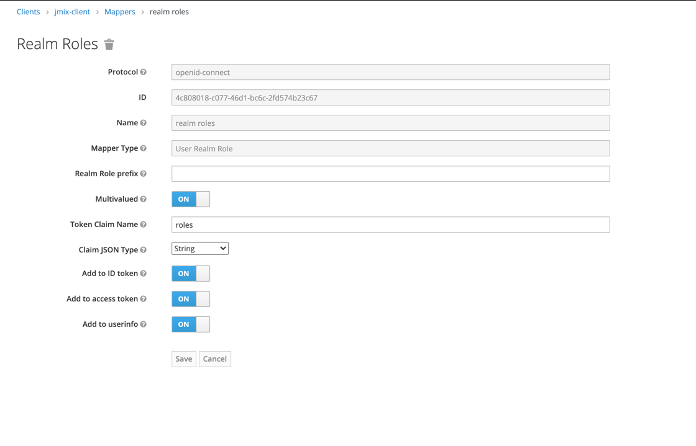
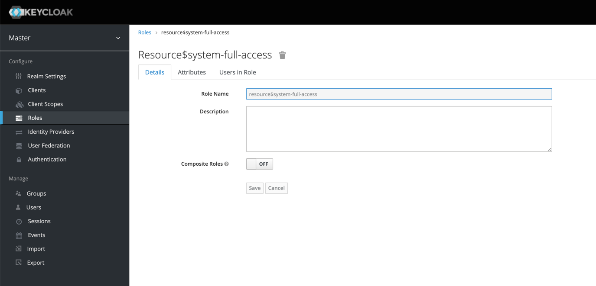
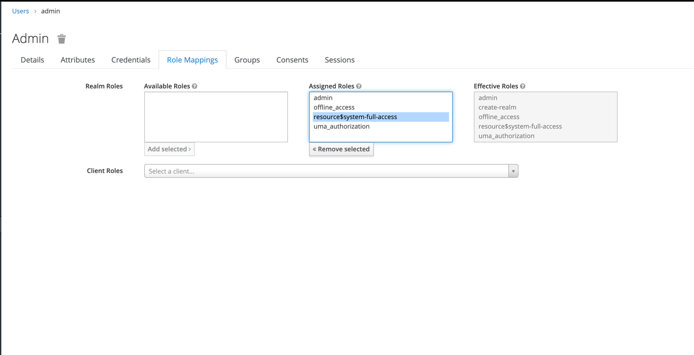

# Sales - Keycloak Integration Demo

---

## Launch KeyCloak

Use `docker-compose.yml` in the project root to launch Keycloak.

```
docker-compose up
```

Admin credentials:
```
Username: admin
Password: admin
```

Keycloak Url: http://localhost:8180/auth

## Set up Client for OIDC connection

In order to connect Jmix application to Keycloak, we need to create new client **jmix-client** with the Client Protocol **openid-protocol**.



**Note:** You can import prepared client by pressing `Select file`. Example: [jmix-client](export/jmix-client.json)

Set **Access Type** to `confidential` for the client.



Set **Valid Redirect URIs** to the `http://localhost:8080/*`.

After saving the new tab **Credentials** will appear. It displays **Client Secret**,
which we need to set up connection in the Jmix project.



Specify parameters of the created client in the **[application.properties](src/main/resources/application.properties)** file.

```yaml
## Keycloak
# Issuer, Url Keycloak, where "master" is the name of the realm where client is created
# and where users will be stored
jmixkeycloakdemo.keycloak.issuerUri=http://localhost:8180/auth/realms/master
# Client ID
jmixkeycloakdemo.keycloak.clientId=jmix-client
# Client Secret
jmixkeycloakdemo.keycloak.clientSecret=ff538a73-7c6c-495b-b7f9-b08eb9e2f15b
# Uri of the Jmix application. Here browser will be redirected after successful login to KeyCloak
jmixkeycloakdemo.keycloak.redirectUri=http://localhost:8080
```

### Creating the Mapper
Now we need to create roles in KeyCloak, they will be mapped to Jmix roles (otherwise logged in user will not be able to access anything in the app). Then create the **Mappper** in the '**jmix-client**' client that will map assigned roles to the User in KeyCloak, and return them to Jmix application in the JWT token.

To do that, we need to navigate to the **Clients -> Jmix-client -> Mapper** and add the following **Mapper**.



## Creating the role

Create role **resource$system-full-access** in the format `<role-type>$<jmix-role-code>`.



Then assign this role to the user, after navigated to the **Users -> Admin**:



The application is coded the following way that after each successful login a new 
[OidcUserDetails](/src/main/java/com/company/samplesales/keycloak/user/JmixOidcUser.java) is created:

```java
    private OAuth2UserService<OidcUserRequest, OidcUser> oidcUserService() {
        OidcUserService delegate = new OidcUserService();
        return userRequest -> {
            OidcUser user = delegate.loadUser(userRequest);

            Collection<? extends GrantedAuthority> userAuthorities = getUserAuthorities(user);
            JmixOidcUser jmixUser = userSynchronization.synchronizeUserDetails(user, userAuthorities);
            return jmixUser;
        };
    }

    private Collection<? extends GrantedAuthority> getUserAuthorities(OAuth2User user) throws OAuth2AuthenticationException {
        ArrayList<String> roles = user.getAttribute(ROLES);
        if (roles != null && !roles.isEmpty()) {
            List<GrantedAuthority> authorities = new ArrayList<>();
            authorities.addAll(user.getAuthorities());
            authorities.addAll(keycloakRolesMapper.createAuthorities(roles));
            return authorities;
        } else {
            return user.getAuthorities();
        }
    }
```
In the `getUserAuthorities` method the list of roles is obtained from the attribute (`user.getAttribute(ROLES)`), and then they are mapped to Jmix roles in the  [KeycloakRolesMapper](src/main/java/com/company/samplesales/keycloak/config/KeycloakRolesMapper.java).

## Rest API

As an example, a REST endpoint has been created that requires authentication.

To obtain the access token, use the Url: http://localhost:8180/auth/realms/master/protocol/openid-connect/token:

Пример:
```java
curl --location --request POST 'http://localhost:8180/auth/realms/master/protocol/openid-connect/token' \
--header 'Content-Type: application/x-www-form-urlencoded' \
--data-urlencode 'username=admin' \
--data-urlencode 'password=admin' \
--data-urlencode 'grant_type=password' \
--data-urlencode 'client_id=jmix-client' \
--data-urlencode 'client_secret=ff538a73-7c6c-495b-b7f9-b08eb9e2f15b'
```

Test endpoint [UserRestController](src/main/java/com/company/samplesales/rest/UserRestController.java)

Example request:
```java
curl --location --request GET 'http://localhost:8080/rest/userInfo' \
--header 'Authorization: Bearer <access_token>
```
## Credits
Initial integration demo has been implemented by https://github.com/NikitaShchienko.
